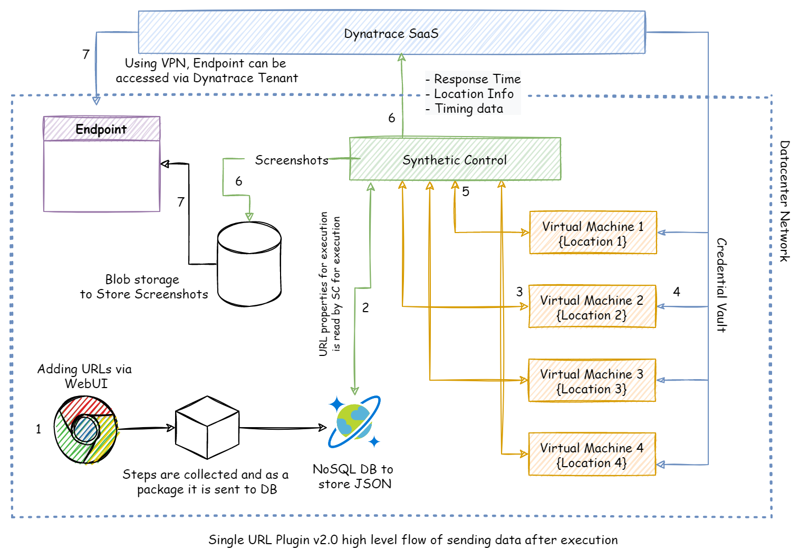
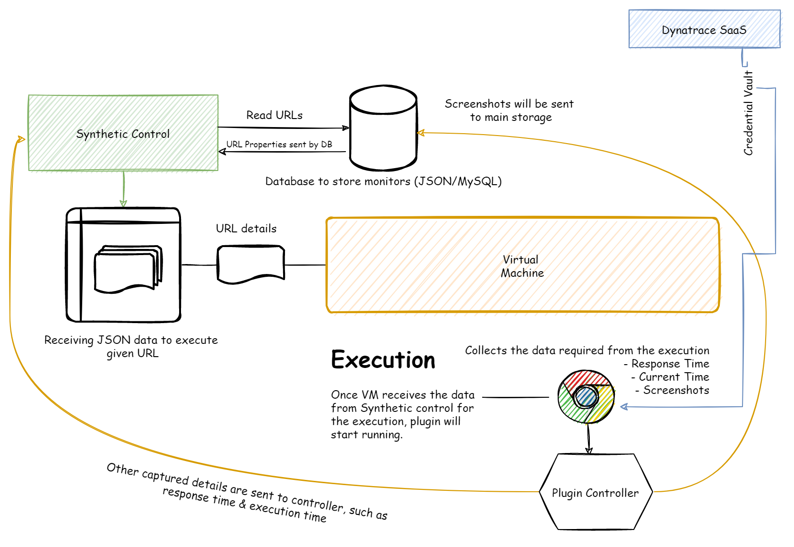
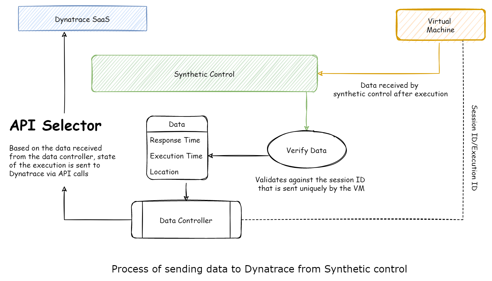

<button class="btn js-toggle-dark-mode">Switch to dark mode</button>

# Getting Started with Single URL Plugin
Please visit Single URL Plugin 2.0 Changes to see what's new in 2.0 version of the plugin. 

## Table of contents
{: .no_toc .text-delta }

1. TOC
{:toc}

---

## Introduction
Single URL Plugin is a type of tool which checks the availability, response time, status code of the URL which has SSO, Form-Based, Direct, and Basic authentication protocols, and then sends the data to Dynatrace. All the data is collected will be shown in Dynatrace as a part of the synthetic monitor. This plugin uses a third-party synthetic API to ingest the data to Dynatrace. 

As a part of an update with v2.0, screenshots will be captured of each step and every run and then it will be stored in a certain endpoint where users can access it. 

## Components
Here is the list of required tools, environment, & libraries that are required for this plugin.

### Environment
{: .no_toc .text-delta }
1. A virtual machine or physical machine with below configuration.
    

      
Machine Configuration

  
      #### Configuration
      {: .no_toc .text-delta }
      - Windows Server 2016/2019 or Windows 7/8.1/10
      - 4 vCPUs
      - 8 GB RAM
      - Minimum 100 GB disk space in OS Partition
    

2. One server should be dedicated per location if you are trying to use multiple location execution. 
3. As a control center, a separate server needs to be provisioned where it works for sending test results to Dynatrace.
4. As a failover mechanism, you can have multiple synthetic control center servers with the configuration as specified below.
    

      
Control Center Configuration

  
      #### Configuration
      {: .no_toc .text-delta }
      - Windows Server 2016/2019 or Windows 7/8.1/10
      - 8 vCPUs
      - 16 GB RAM
      - Minimum 100 GB diskspace in OS Partition
    

### Tools
{: .no_toc .text-delta }
1. **Version Control System -** VCS is a tool that enables developers to track the development activities without losing any of the previous code. In this case, we can use *GitHub* or *Azure DevOps* as a part of software development and delivery.
2. **Deployment Agent -** Software responsible for deployment and maintaining the software in all the machines where the plugin is installed. This includes *Git* or *Azure DevOps Agent*. 
3. **Chromium/Edge Driver -** Used to simulate real user test scenarios.
4. **Selenium Webdriver -** Selenium is used as a part of an automated testing tool for the websites that we monitor.

### Coding & Libraries
{: .no_toc .text-delta }
- **Python3** - Programming that is used to build the plugin.
- **PyCharm CE** - IDE used for the development of plugin.
- **Libraries** - requests, schedule, xlrd, urllib3, datetime & selenium.
- **Dynatrace APIs** - External synthetic API, Credential Vault API & Events API.

---

## Technologies
Single URL Plugin uses different technologies to get things done. Below are the technologies it uses to complete its execution.

**List of Technologies**
1. Python3
2. Windows Task Scheduler
3. REST APIs
4. Dynatrace Credential Vault
5. JSON
6. GitHub (VCS)
7. Azure DevOps
8. Selenium
9. Chromium
10. Azure Cosmos DB/Firebase/Local Storage

---

## How this works?

The above flow diagram gives you the overall working of Single URL Plugin v2.0. It works in 7 steps to complete its execution with all other failover runs are taken care of. 

### Steps
{: .no_toc .text-delta }
1. To start with, the user will access the given site where maintenance of the plugin can happen. Actions are updated in the respective NoSQL DB (Azure Cosmos DB/Firebase/Local Storage). These are stored as JSON data. Users can perform these actions, 
    - Add URLs and their properties
    - Modify those URLs
    - Delete URLs from execution
2. In the second step, the synthetic controller will poll the DB from time to time to check the URLs and their modification. It will take URL, Scheduled time, Steps for execution, and any other properties that are required and sent to their respective VMs for execution.
3. When URLs are sent to their respective VMs in a different location for execution, the Plugin controller will help the execution which uses Chrome for the execution. Please take a look at the flow on how VM executes URLs below.
    
4. In the 4th step, as you can see the above diagram, credentials are fetched from the Dynatrace credential vault via API.
5. Execution data ios sent to Synthetic Controller. Depending on the scenario, screenshots are directly stored in DB, or sometimes it is sent to the synthetic controller.
6. In this step, as below flow diagram explains how synthetic controllers send data to Dynatrace. It uses an identification mechanism for each data that is received by the controller from different VMs. It validates with the help of a data controller and then chooses to send data to Dynatrace via external synthetic API and events API.
    
7. Finally, stored screenshots and the data that is sent to Dynatrace can be viewed in the web app and Dynatrace portal respectively.

## Dynatrace Capabilities
Once data is sent to Dynatarce, you can do multiple things with that like, 
- Creating dashboards
- This plugin will inject more metrics data than it shows in the UI. You can always use those metrics to plot in the dashboard or use it for your reporting purposes.
- Setting up alerts (custom events for alerting)