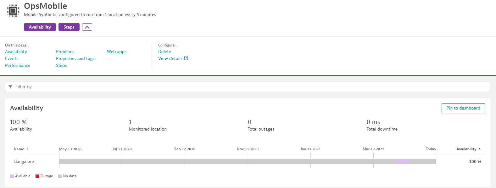
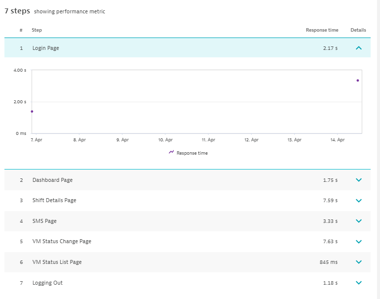

# Single URL Monitoring v2.0
{: .no_toc }
As we all know that the version 1.0 was a good hit and certainly it had flaws of its own. To improve and build a better version this time, we will be working on making this the best product release yet. With 2.0 you can feel safe, sit back and relax because, we will be adding more security features like credential vault and automated AI integration with this. One good thing about this is, you will get events alerting when there is a password expiry or your site is due for maintenance. (Email Alerts will be triggered.) 


## Table of contents
{: .no_toc .text-delta }

1. TOC
{:toc}

---

## Primary Changes:
- Security (Credential Vault)
- Password Expiry Notification
- Use of Dynatrace Synthetic Monitoring Capability
- Adding anomalies to Dynatrace AI engine for dependency analysis
- Create beautiful dashboards with honey comb tiles
- Same license usage as 1.0 (DDUs)

## Major Project Milestones
1. Integration to Dynatrace Synthetic Monitoring
2. Security Measures
3. Development Changes (Redesigned Synthetic Engine)
4. Alerts on Password Expiry
5. Minimization of Alerts
6. Same License Consumption as HTTP monitors

### 1. Integration to Dynatrace Synthetic Monitoring
This is one important update that we want to announce in this new update where instead of using Custom devices in Dynatrace we will be using third-party synthetic monitoring and will be ingesting data points in the form of external synthetic APis.

#### Benefits
{: .no_toc .text-delta }
Main benefit of this update will be, you will get dedicated profiling and the monitor mertics will go to baselining cube and alerts you rteceive will be depending on automatic baselining and performance thresholds. This si just a top of the iceberg. There are loads of new enhancements will be there in this which includes below benefits, 
- Dashboard
  - Honey Comb Dashboard Tile
  - Dedicated third-party synthetic tile
- Alerts
  - Alerts can be configured based on automatic baselines
  - Outage alerts will be added to dependency analysis
  - Root cause detection (Dynatrace AI monitored entity)
- User Interface change
  - Data that is sent through APIs will be taken for analysis and it will give you graph inside the monitor
  - A new UI is adopted which is different from tradition custom device UI.
    
  - Analysis of each run can be made step by step. (Similar to Browser monitor)
    
  - Location wise analysis is possible

### 2. Security Measures
In 1.0 we were using excel sheet to store passwords and other selector information that it should send to Dynatrace and then our python library was featching those details and then data is pushed through functions. It was somehow making updation of new URLs and other content difficult along with that there are chances for those passwords to be compromised. Hence, we came up with a plan to use credential vault that Dynatrace provides.

#### Benefits
{: .no_toc .text-delta }
- Credential Vault is used 
- Suggestions to use strong password before storing password in Dynatrace vault
- Other data like, CSS selectors, app details and meta data of each monitor will be stored in the centralised location that to in JSON format instead of excel.

### 3. Development Changes (Redesigned Synthetic Engine)
Development changes are very extensive in 2.0. It uses the same foundation of 1.0 but in improved format with enormous efficiency. In 1.0 we are using sane resources from each VMs to schedule, run and report to Dynatrace but in 2.0 execution will be maintained by certral engine where it will be responsible for all other executions that happen in each location.

#### Benefits
{: .no_toc .text-delta }
- Resource consumption in every VM will be considerably less (Comparision data will be provided as we go through developemnt process).
- Central main engine that is responsible for running tests from each VMs.
- UI will be provided to add/remove URLs from the monitor.
- Gererating automated reports for each monitor (v.2.5).
- You can monitor the health of each monitor that is executing in the UI itself.

### 4. Alerts on Password Expiry
You will be alerted to your email along with an event will be created in Dynatrace then the execution will be stopped until the password is changed and you manually resume the execution in the portal. 

#### Benefits
{: .no_toc .text-delta }
- An Info event will be created in Dynatrace
- Execution will be stopped and for reporting the availablity, this time will not be considered.
- Email will be sent upon expiry

### 5. Minimization of Alerts
Since thuird-party synthetic will move to Dynatrace Davis cube to consider alerting and root cause analysis, static alerts will always be removed and instead automated baselines alerts will be set and reflected.

#### Benefits
{: .no_toc .text-delta }
- Dynatrace Davis Alerting 
- Automated Baselines

### 6. Same License Consumption as HTTP Monitors
It consumes 0.1 DDUs for each run from each location for each step. that is if you have 4 steps running from 10 locations every 15 mins, total consumption of DEM units per year would be, ```0.1 * (4 + 10) * 4 * 24 * 365 = 1,40,160 DEM units```.

## Pre-requisites
Hardware and Software requirements will be mentioned in coming days once the project timelines are finalised. 