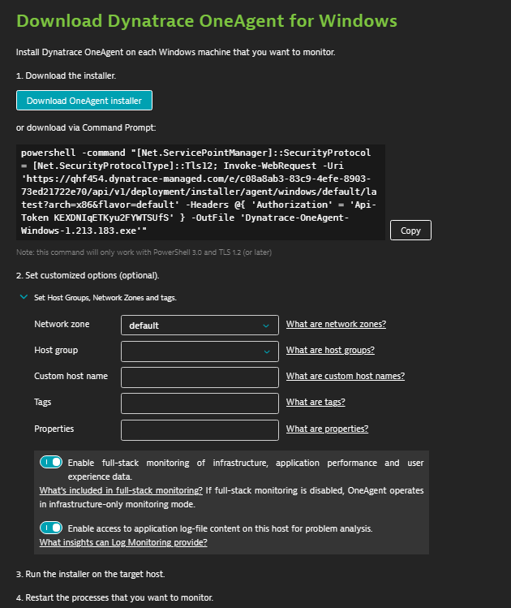
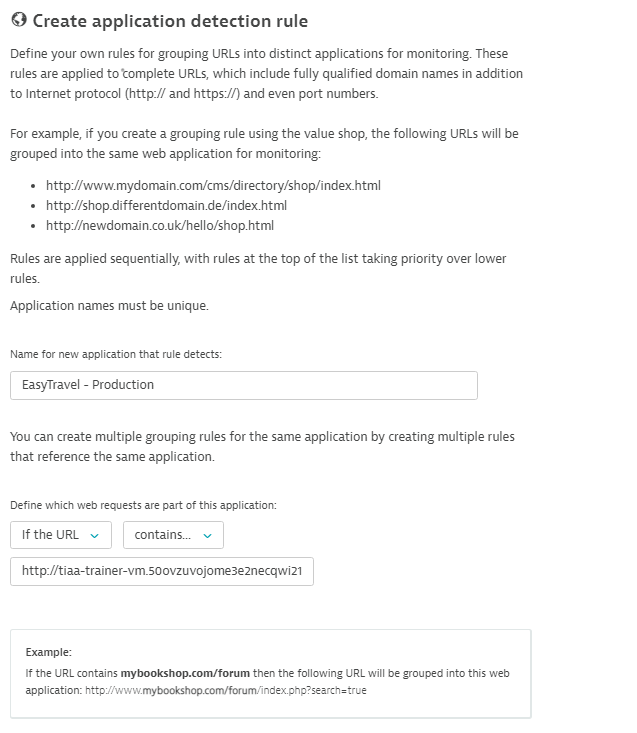
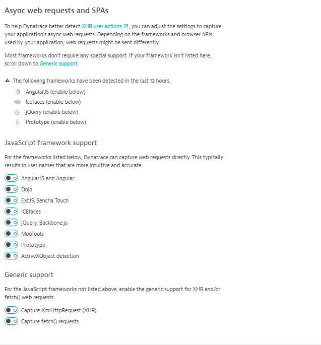
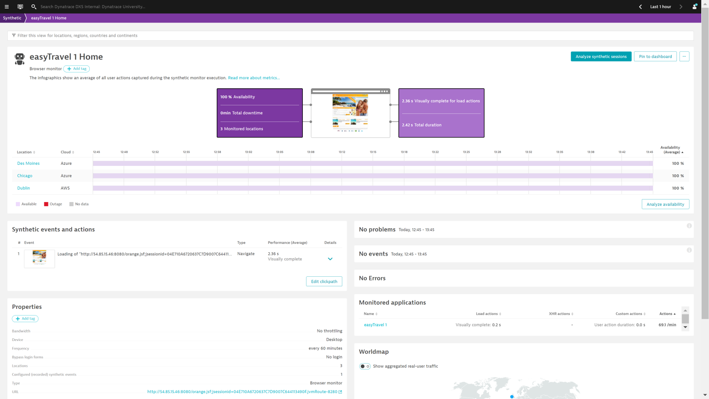
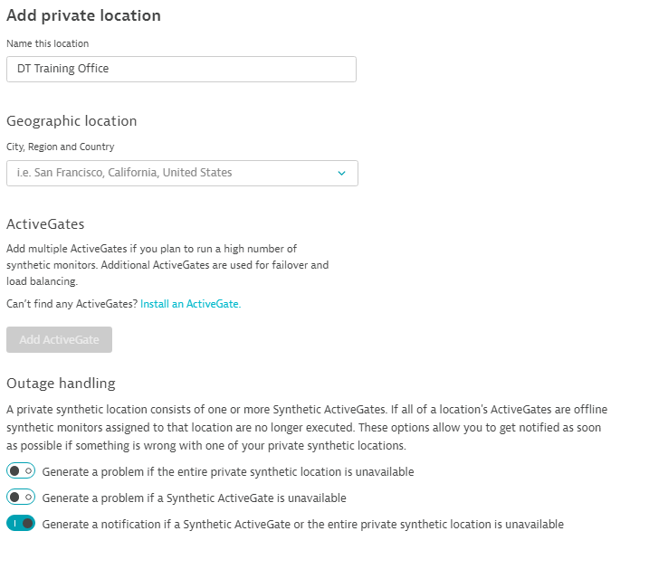

# Dynatrace Basics - Lab Activities 101
{: .no_toc }
<!-- ------------------------ -->
## Getting Started
{: .no_toc }


Hello, 👋 Welcome to Dynatrace training. We know it has been a long journey for you to get to here. It is all like, getting education atleast for 15 years and jumping into job and finding your ways to stick to one domain. We appreciate the effort and we respect you immensely. Thank you for taking this training. From Dynatrace India, we wish yuo all the best and keep learning. We are here to help you anytime. If you have questions or if you need any help, please raise an issue in our public GitHub repository. We will addres it for you as soon as we can. 

### User repository
{: .no_toc }
1. Here is the link for the repository: [https://github.com/Dynatrace-India/Dynatrace-Training/issues](https://github.com/Dynatrace-India/Dynatrace-Training/issues)
1. Checkout Dynatrace Official Help: [https://www.dynatrace.com/support/help/](https://www.dynatrace.com/support/help/)

Negative
: Note that please use this repository only if you are really passionate to learn about Dynatrace. This is an initiative from Dynatrace India ACE team to help people who are curious. 

### What's in here
{: .no_toc }
- List of training activities with instructions
- Explaination about the terms that are new
- Some documentation links to help you learn more
- Closing charts

<!-- ------------------------ -->
## What you'll learn 
{: .no_toc .text-delta }

1. TOC
{:toc}

<!-- ------------------------ -->
## Activity: Setting-up lab environment

In this training lab, we have provided you with 2 VMs which will be used for lab activities. Hence, before starting the training please get to know your credentials and that are sent to you to your email personally along with RDP files to connect to VMs.

### Lab Activity
{: .no_toc }
1. Sign in to your mail box and find an email with RDP files and password to access them.
1. Once login is complete, use another email that you have received from **notifications-dynatrace** and login to dedicated Dynatrace environment for training.
1. If you want to access anytime after setting password to your DT Environment, please use this link [https://dt-transform.com](https://dt-transform.com)
1. Raise your hand if you are able to set up environment and access virtual machines.
1. Using this link, [EasyTravel](https://community.dynatrace.com/community/display/DL/Demo+Applications+-+easyTravel#DemoApplications-easyTravel-Download(Installer+License)) please download Windows version of the application (x64) and install it in both your VMs.
1. Start easyTravel via the UI, clicking on Dynatrace Production Standard.
1. This will ensure that the application is running. you can make sure by visiting the site the is shown in the window of EasyTravel.
1. Congratulations! Now you are ready to implement and move forward with the training. 

<!-- ------------------------ -->
## Activity: Installing Dynatrace OneAgent

### Accessing Dynatrace Environment
{: .no_toc }
- Access your environment by going to this link, [https://bit.ly/dt-transform](https://bit.ly/dt-transform)
- Login with your credentials
- Go to Dynatrace Hub

### Installing OneAgent
- In Dynatrace Hub, search for OneAgent and click on the card to access OneAgent details page
- Click on Download OneAgent button and it will take you to the screen where you have to choose the OS.
- Go ahead and select Windows.
- Download the installer. There are two options:
	- Click the Download Installer button to download the Windows installer (EXE file) for single-server installation.
	- The OneAgent Windows EXE installer is preconfigured for your environment. If you need to customize it, you can add add the installation parameters at a Windows command line. You can also add the ```--set-param=<value>``` parameters on the Configure OneAgent settings installer screen.
	- For more information, see Customize OneAgent installation on Windows



- Run the executable file and follow the displayed instructions. If your environment is segmented, for example into development and production, consider organizing your hosts into host groups. To do this, select the Set host group for this host option and provide a name. If the name you enter exists already, the host will be added to the group with this name. If you provide a new name, a new host group will be created. The EXE installer provides a quiet mode. Simply use it with command-line ```--quiet``` parameter.
- Restart all processes that you want to monitor. You’ll be prompted with a list of the processes that need to be restarted. Note that you can restart your processes at any time, even during your organization’s next planned maintenance period. Though until all processes have been restarted, you’ll only see a limited set of metrics, for example CPU or memory consumption.

### Next steps
{: .no_toc }
- Access the Deployment Status screen.
- Stop and restart easyTravel UI.

<!-- ------------------------ -->
## What happens during the installation of OneAgent?
OneAgent is a set of specialized services that have been configured specifically for your monitoring environment. The role of these services is to monitor various aspects of your hosts, including hardware, operating system, and application processes.

During the installation process, the installer
- Installs executable code and libraries that are used by OneAgent.
- Creates entries in the Windows Registry that start OneAgent as a SYSTEM service. Additionally, the oneagentmon device and WinPcap are installed to allow better integration with the operating system and to facilitate the capture of network statistics.
- Checks the system’s global proxy settings.
- Checks for a connection to Dynatrace Server or ActiveGate (if you installed ActiveGate and downloaded the OneAgent installer after ActiveGate was connected to Dynatrace).
- ```OneAgent 1.193 and earlier``` Creates its own user (dtuser) to run OneAgent extensions. This user is a member of the Performance Monitoring Users group, and can only log in as a service. The password is randomly generated during installation and stored encrypted. You can't change the password. For security purposes, the dtuser is not allowed to:
	- Access computer from the network.
	- Log in as a batch job.
	- Log in locally.
	- Log in through Remote Desktop Services.
	- The dtuser is required for Dynatrace to operate properly, therefore you must not delete it. If, for some reason, the dtuser was deleted, next update will recreate it.
- ```OneAgent 1.195+``` For fresh OneAgent 1.195+ installations, the default ```LocalSystem account``` is used to run OneAgent extensions. For a summarized view of the changes made to your system by OneAgent installation, see [OneAgent security on Windows](https://www.dynatrace.com/support/help/technology-support/operating-systems/windows/installation/oneagent-security-windows/).

Positive
: For more details on the installation, please go through this link from Dynatrace help on [Install OneAgent on Windows](https://www.dynatrace.com/support/help/technology-support/operating-systems/windows/installation/install-oneagent-on-windows/#expand-what-happens-during-installation-3846)


<!-- ------------------------ -->
## Activity: Smartscape


- Select a host. Observe the processes associated with the host selected. 
- Select the Apache Tomcat process. Note how many services are attached.
- Click a service. Note the difference in the Smartscape.
- Click the arrow. The Services Overview page displays. 
- Click Smartscape view. 

Positive
: For more instructions on Smartscape, please go through Dynatrace help on [Smartscape](https://www.dynatrace.com/support/help/how-to-use-dynatrace/smartscape/).

<!-- ------------------------ -->
## Activity: Installing ActiveGate

- Navigate to Dynatrace Hub > ActiveGate > Install ActiveGate > Windows
- Download the Installer - Windows.
- Run the installer on the host(s) where the ActiveGate(s) will run.
- ActiveGate Runs within your data center
	- For Agent traffic bundling
	- For remote plugin execution
	- Storing memory dumps
- Already connected Agents automatically reroute through AG when found.

Positive
: For more details on Installation of ActiveGate, visit this link [Install an Environment ActiveGate on Windows](https://www.dynatrace.com/support/help/setup-and-configuration/dynatrace-activegate/installation/windows/windows-install-an-environment-activegate/)

<!-- ------------------------ -->
## Activity: Practice

- Navigate to the Home Dashboard
- Access the tiles available, and record what you are able to view. 
- Filter the dashboard based on the last 1 hour. Notice how the dashboard data changes. 
- Access the Smartscape from the Dashboard, locate easyTravel and note the services, processes, hosts, and data centers connected. 
- Access an Apache Tomcat host via the home dashboard. Note the CPU usage. 

<!-- ------------------------ -->
## Activity: Application Configuration

### Steps
{: .no_toc }
- Go to ```Settings``` -> ```Web & mobile monitoring``` -> ```Application detection & RUM```
- Under Application detection rules, click Create application detection rule
- Set the following:
	- New application
	- Provide a name. e.g. ```“EasyTravel - Production”```
	- “If the URL” and “contains...” followed by the URL of your Windows VM
- Repeat the steps for another Application detection rule
	- New application
	- Provide a name. e.g. ```“EasyTravel - Development”```
	- “If the URL” and “contains...” followed by the URL of your Windows VM



### Alternate way
- You can also create an application in a pretty straight forward way by visiting the ```My web application```.
- Navigate to ```Applications``` from tyhe global menu
- Go to ```My web application``` and scroll through the bottom of the page and find the top 3 domains section.
- In here you will find all the domain names that Dynatrace detected.
- Click on ```View full details```
- In the Transfer domain column, use the arrow to expand the domain which you want to create application for, 


- Click on ```Create new application``` and new application will be created with the domain name you selected. 
- Navigate to the application and rename the application to ```Easytravel - <Environemnt>```

Positive
: Please note that this feature of Creating new application is added by recent releasses and in this you can also map different domains and transfer them to the application. 

<!-- ------------------------ -->
## Activity: Monitor your application

### Monitor through
{: .no_toc }

- Go to your ```Real User Monitoring``` dashboard. Take a moment to review the tiles and the information displayed.
- Drill into the Application health tile.
	- Review the information available in the table.
	- Drill into the EasyTravel application. Review the tables and charts available.
	- Click different options available under Load Actions/XHR actions such as:
	- Median, slowest, fastest 
	- Show/hide options in the charts: User action duration, actions/ min
	- Click to see ‘Compare to previous time frame’ and ‘Analyze performance’
	- Analyze different time frames by changing the global timeframe selector.
- Return to the dashboard. What can you see in the Worldmap under Application Health?
	- What additional information can you see when you drill into the Worldmap?
- Click Applications in the main navigation menu. Where has this taken you?
- Change from generated visits to manual visits in easyTravel.

### Enabling Framework monitoring
{: .no_toc }
- To enable framework monitoring like, AngularJS, ReactJs, jQuery and to capture XHR actions of your application, please follow the steps.
- Go to the application, click on ```...``` -> ```Edit``` -> ```Capturing``` -> ```Async web requests and SPAs```.
- Please enable the required frameworks support.
- Supported frameworks that require enabling will be shown there itself.
- Enable them and for generic support you need to enable ```XmlHttpRequest``` and ```fetch()``` and then save the settings.



Negative
: Please note that enabling frameworks support will increase the load time of the page and header value will increase. If you have any restrictions on injection of extra header due to security purpose in your organisation, take help from experts of refer the documentation, [Real User Monitoring](https://www.dynatrace.com/support/help/how-to-use-dynatrace/real-user-monitoring/#how-to-use-real-user-monitoring)

<!-- ------------------------ -->
## Activity: User actions in EasyTravel

### Validate User actions
{: .no_toc }
- Access easyTravel using the IP address provided.
- Search for and book a trip. 
- Visit the EasyTravel URLs using your cell phone. 
- Search for a second trip, review its contents and then leave the site. 

Positive
: Visiting EasyTravel from your handheld device will be tracked by Dynatrace as well. In application overview you can see the user visiting from mobile browsers. 

<!-- ------------------------ -->
## Activity: Define Conversion Goals
Duration: 5

### Defining goals
{: .no_toc }
- Access easyTravel and book a few trips using different user accounts.
- Create a conversion goal for a user booking a trip: 
	- Name: ```Trip Booked```
	- Type: ```User Action```
	- Rule ```applies to: Load actions```
	- Rule: ```Page URL contains orange-booking-finish```
- Access easyTravel and book some additional trips.
- Filter user sessions by conversion goal.
- Drill down into the session, events and actions. 

Negative
: In order to reflect conversion goals in the Dynatrace portal, you need to perform the complete transactions for atleast 5 times. After a while conversion goal will be reflected. This is useful in defining SLO in Dynatrace too. 

<!-- ------------------------ -->
## Activity: Create a Key User Action

### Mark the action
{: .no_toc }
- Open your application. 
- Find the Top 3 User Actions and look for the action Loading of page /orange-booking-finish.jsf
	- You may need to drill into “View full details” to find it in the list of Top 100 user actions.
- Open the action and select “Mark as key user action”
- Pin the action to your Dashboard.

<!-- ------------------------ -->
## Activity: Locate your user session data

### See your data
{: .no_toc }
- In the main navigation menu, click User sessions.
- Review the data for the last 2 hours and then the last 30 minutes.
- Drill into a user session entry. Review the following by clicking in the graphic:
	- Location
	- Type of devices used
- Expand one of the sessions for this user. Hover over each point in the chart to review their action at that point.
- Click on one of the points to explore that action in more detail.
- While exploring the User sessions note:
	- How does the view change? 
	- What type of actions were performed?
	- Was the user satisfied? 
- In a Load action, click ```“Perform waterfall analysis”```
- Explore the chart and the options available.

Positive
: To know more about applications and how front end captures the we request timing in Waterfall analysis, please refer to the MDN docs on Web request timing, [Navigation Timing API](https://developer.mozilla.org/en-US/docs/Web/API/Navigation_timing_API). Also, please refer to the official Dynatrace Help on, [Waterfall analysis](https://www.dynatrace.com/support/help/how-to-use-dynatrace/real-user-monitoring/how-to-use-real-user-monitoring/web-applications/waterfall-analysis/)

<!-- ------------------------ -->
## Activitiy: Build a DevOps Dashboard

### Create a Dashboard
{: .no_toc }
1. Create a new dashboard called ```“DevOps”```
1. Create a section called ```“Applications”``` and add the following tiles:
	- ```Application Health (number version)```, ```Synthetic monitor health```, ```Application Health (graph version)```, ```Resources – Load Time```
	- ```Mobile App```, ```Application```, ```Browser monitor```
1. Create a section called “Services” and add the following tiles:
	- ```Service health```, ```Databases```
	- Select the top two services and add tiles for Service or request
1. Create a section called “Infrastructure” and add the following tiles:
	- ```Host health```, ```Docker```, ```Network Status```, ```Network Metrics```
1. Save the dashboard. 
1. Return to your ```Real User Monitoring``` dashboard. Access your Key User Actions tile and pin it to your new dashboard. 


<!-- ------------------------ -->
## Activity: Create a Browser Monitor

### Create Synthetic Monitor
{: .no_toc }
- Select Synthetic from the menu.
- Click Create a synthetic monitor.
- Click Create a browser monitor.
- On the Configure a synthetic monitor page, type in the URL you want to monitor and give it a unique name.
Configure your monitor appropriately, including selecting the profile of your emulated device, choosing monitor frequency and locations, and other settings.
- Click view monitor summary.
- Click create browser monitor.



<!-- ------------------------ -->
## Activity: Create an Clickpath Monitor

### Follow these steps
{: .no_toc }
1. Install the Dynatrace Synthetic Recorder extension
	- Select Synthetic from the navigation menu.
	- Click ```Create a synthetic monitor``` > ```Create a browser monitor```.
	- First-time users are asked to install the Chrome extension. Click ```Install Dynatrace recorder``` at the bottom of the page.
	- On the extension page, click ```Add to Chrome``` > ```Add Extension```.
	- Once the extension is added, please allow it in ```Incognito mode``` as well. 
1. Navigate to Synthetic.
1. Click ```Create a synthetic monitor```.
1. Click ```Create a browser monitor```.
1. Enter a valid URL.
1. Check the default name for your clickpath on the Configure a browser monitor page.
1. Record a browser clickpath.
	- Select ```Synthetic``` from the navigation menu.
	- Click the ```Create a synthetic monitor``` button.
	- Click ```Create a browser monitor```.
	- Enter a valid URL and check the default Name for your clickpath on the ```Configure a browser monitor``` page.
1. Continue to configure the monitor—device profile, frequency, monitoring locations, and other options such as cookies and automated login. 
1. Click Record clickpath.
1. When done, click the Dynatrace extension icon on your browser's menu bar to see a list of recorded events and Finish recording.
1. Playback your clickpath. 

<!-- ------------------------ -->
## Activity: Install a Synthetic-enabled ActiveGate

### Installing ActiveGate with SYnthetic Enabled
{: .no_toc }
1. For Environment ActiveGate, from the navigation menu, select ```Deploy Dynatrace``` > ```Install ActiveGate```. 
1. Select the operating system and follow the on-screen instructions.
1. For ```What's the purpose of this ActiveGate?```, select Run synthetic monitors from a private location.
1. Download the installer
1. Install the ActiveGate in the VM/Machine using command line by pasting the command that is generated in the belo step of Installation page in Dynatrace. 

<!-- ------------------------ -->
## Activity: Add a private location

### Add Synthetic Location
{: .no_toc }
- In the Dynatrace web UI, go to ```Settings``` > ```Web & mobile monitoring``` > ```Private synthetic locations```.
- Select ```Create location```.
- Give your location a custom Name, for example ```DT Training office```.
- Map it from an existing geographic location or add a new one. This is defined by Region, City, and Geographic coordinates.



- Add the ```Synthetic-enabled ActiveGate``` you've just installed to the location.
- Select ```Add```.
- Select ``Save```.
- Now you can change the location to the newly added private location in your Synthetic monitors from the ones you have created previously. 

<!-- ------------------------ -->
## Activity - Automatic Tagging

### Tag all entities belongs to the Development
{: .no_toc }
- From the navigation menu, go to ```Settings``` > ```Tags``` > ```Automatically Applied Tags```
- Click on ```Create tag```
- Enter the name for the tag you want to apply
- Click on ```Add a new rule```


- Now we can add condition for the entities that are having host groups to tag with Development or Production. 
	- In order to do that you can create multiple tags, so for now in this tag let’s tag the entities of Development
	- After creating this we need to follow the same process for production entities as well. 
	
	- Click on preview to view all the affected entities
	

- Check out entities for the tag and Voila!!!! You have successfully created Automatic tagging rules.

<!-- ------------------------ -->
## Activity: Create a User Tag

### Tag a user in EasyTravel
{: .no_toc }
- From the navigation menu, click Applications.
- Select the application you want to configure.
- Click the Browse (…) button and select Edit.
- Click the User tags tab.
- Click Add tag (identifier) rule.
- From the Expression type to capture drop list, select CSS selector.
- Type the CSS selector value into the CSS selector field.
	- Enter: copied selector from the webpage
	

- Click Add tag (identifier) rule and then click Save.
- Wait for 4 to 5 minutes and see the tags are reflecting in user sessions

<!-- ------------------------ -->
## Activity: Create an alert profile and email integration

### Creating Alerting Profile
{: .no_toc }
- Go to ```Settings``` -> ```Alerting``` -> ```Alerting Profiles```.
	- Create an Alerting Profile named “easyTravel Support.”
	- Leave the Severity rules as the defaults, but spend a few minutes exploring the options.
	- Also explore the options for creating event filters, but do not create one.

#### Severity Rules
{: .no_toc }


Positive
: To configure severity rules, you need to understand the concept of problem severity levels. Please follow this Dynatrace help article to know more, [Event Types](https://www.dynatrace.com/support/help/how-to-use-dynatrace/problem-detection-and-analysis/basic-concepts/event-types/)

- Add required severity rules you want for the alerting profuile of you can refer the screenshot above for adding popular types
- Also delaying the problem alert can be done in Alerting profiles based on severity of the problem. For e.g. If the perticular host in the is not available or it got stopped due to outages, it is a priority one for us and there shouldn't be delay in alerting the problem but, in case of errors, we can delay the alerting to make sure we don't get notified for minute errors. 

### Create an Email Integration
{: .no_toc }
- Go to ```Settings``` -> ```Integration``` -> ```Problem notification```.
	- Set up a new e-mail notification to yourself.
	- Review the options available for the Subject line and make changes if you’d like.
	- Selecting the Alerting profile just created.

Positive
: You can also add your own template that you have designed in HTML format to generalize the desifgn pattern of problem notification. 

<!-- ------------------------ -->
## Activity: Add a custom chart

### Create a custom chart
{: .no_toc }
- Click ```“Create custom chart”``` in the navigation menu
- Select a ```category```.
- Select a ```metric```.
- Explore the chart options and filtering.
- Choose an option to Export the chart.
- When your chart is ready click ```Pin to dashboard```.
- Select ```DevOps``` Dashboard we created in earlier session.
- View the chart tile on your Dashboard.
- Click to reopen the chart.


<!-- ------------------------ -->
## Activity: Create a service naming rule

### Create service name rule
{: .no_toc }
- Go to ```Settings``` -> ```Server-side monitoring``` -> ```Service naming rules```.
- Click the ```Add a new rule``` button.
- Name your rule. 
- Define the service name format including any static text string.
	- Example: ```{Service:DetectedName} - {HostGroup:Name}```
- Add one or more Conditions to the rule.
	- Example: ```Host group name``` exists
- Preview your service naming rule to see what the new name would be. 


<!-- ------------------------ -->
## Activity: Create a host naming rule

### Create host naming rule
{: .no_toc }
- Go to ```Settings``` -> ```Monitoring``` -> ```Host Naming```
- Enter a Rule name.
- Enter a rule in the ```Host name format``` field. 
- Combine some text with a placeholder value
	- Tip: Try {Host:DetectedName} - {HostGroup:Name} {Host:IpAddress}
- Try options for matching properties and conditions.
	- Tip: Try host group name exists
- Preview the rule to see the matches and resultant name.
- Save the changes


<!-- ------------------------ -->
## Activity: Create a maintenance window

### Creating Maintenance window
{: .no_toc }
- Go to ```Settings``` -> ```Maintenance windows``` -> ```Monitoring, alerting and availability```
- Select the Type
- Define a recurring schedule (if needed)
- Specify the action:
	- Detect problems and alert
	- Detect problems but don’t alert
	- Disable problem detection
- Define the Scope
- Use the tag filter to assign maintenance windows to the entities that are tagged automatically using aut-tag rule. 
	- Tip: In our case, it is ```Development```
- Save the maintenance window. 
- This also supports via API as well. If you havwe read-only access, yuo can use APIs to schedule maintenance window on the go using Postman or other tools. 


<!-- ------------------------ -->
## Activity: Creating Management Zones

Management zones are comprised of rules that define which entities and dimensional data (such as metrics) can be accessed within each management zone. These rules are based on the powerful Dynatrace tagging engine and other criteria for including entities. In combination with user and group permissions, you can set up management zones to create multiple overlapping partitions in your environment to promote collaboration and security.

### Create Management zone
{: .no_toc }
- Go to Settings > Preferences > Management zones.
- Select Add new management zone.

- Provide a Management zone name.
- Create management-zone rules governing which entities and data are part of and accessible within the management zone. These rules are built upon the powerful Dynatrace tagging engine and other criteria. In the image below, you can see a number of rule examples that you can define to set up a management zone.


### Assign access rights to management zones
{: .no_toc }
- After you set up a management zone, it’s time to define which user groups should have access to the management zone and at what level.

#### Dynatrace SaaS
{: .no_toc }
Go to your Accounts view. User and group permission controls are available when you sign in at https://account.dynatrace.com. You can also access Account settings from the User menu in the menu bar.

Positive
: See [How to apply management zones](https://www.dynatrace.com/support/help/how-to-use-dynatrace/management-zones/how-to-apply-management-zones/) and [Manage user groups and permissions](https://www.dynatrace.com/support/help/how-to-use-dynatrace/user-management-and-sso/manage-groups-and-permissions/) for details.

#### Dynatrace Managed
{: .no_toc }
From the navigation menu of the Cluster Management Console, select ```User authentication``` > ```User groups``` > your user group to assign permissions.


<!-- ------------------------ -->
## Wrapping-up the code lab

### Congratulations, You did it! 🎉
{: .no_toc }
Finally after some hours and days of study, you did it. 👏
Cheers to you for completing the code lab. We are happy that we helped you to prgress in APM career and understanding about Dynatrace. Do you have any suggestions or any mistakes you want to report please feel free to create and issue in our public repository and we will try our best to address it. [GitHub repository](https://github.com/Dynatrace-India/dynatrace-india.github.io/issues)

For now, we say goodbye to you and if you need any help at anytime, please use this [link](https://github.com/Dynatrace-India/Dynatrace-India-ACE-Help/issues) and tell us what you need. We will jump in and help you. 